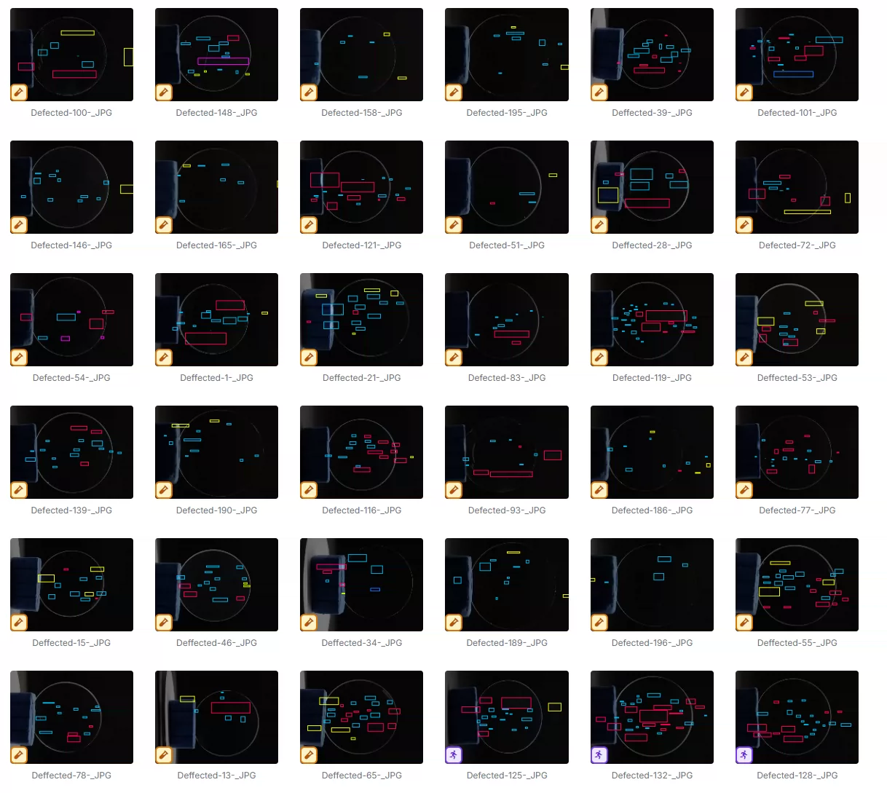
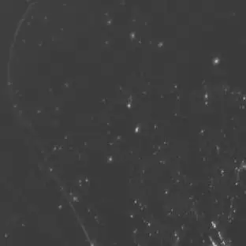
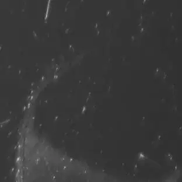
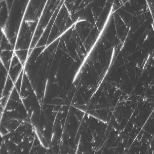
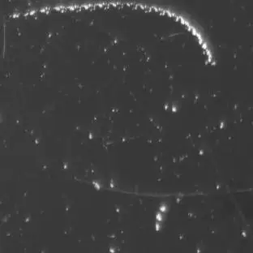
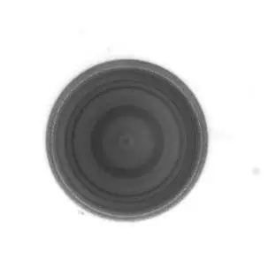

## Body

Optical Lens Defect Detection Dataset YOLOV8

Totally 1000 images, each labeled properly.
Divided into 9 categories, including 'Burr', 'bubble', 'crack', 'deep-scratch', 'dots', 'no-defect', 'other-defect', 'particle', 'scratch'
"Bar", "bubble", "crack", "deep scratch", "dot", "no defect", "other defect", "particle", "scratch"

## Images

item_1033408404451

Here is a pay link on Stripe ( https://buy.stripe.com/3cs8yP7sY87d0vu9AB ). Please contact me lonlonago@foxmail.com after funding $89, and I will send you a complete data files , thank you!

